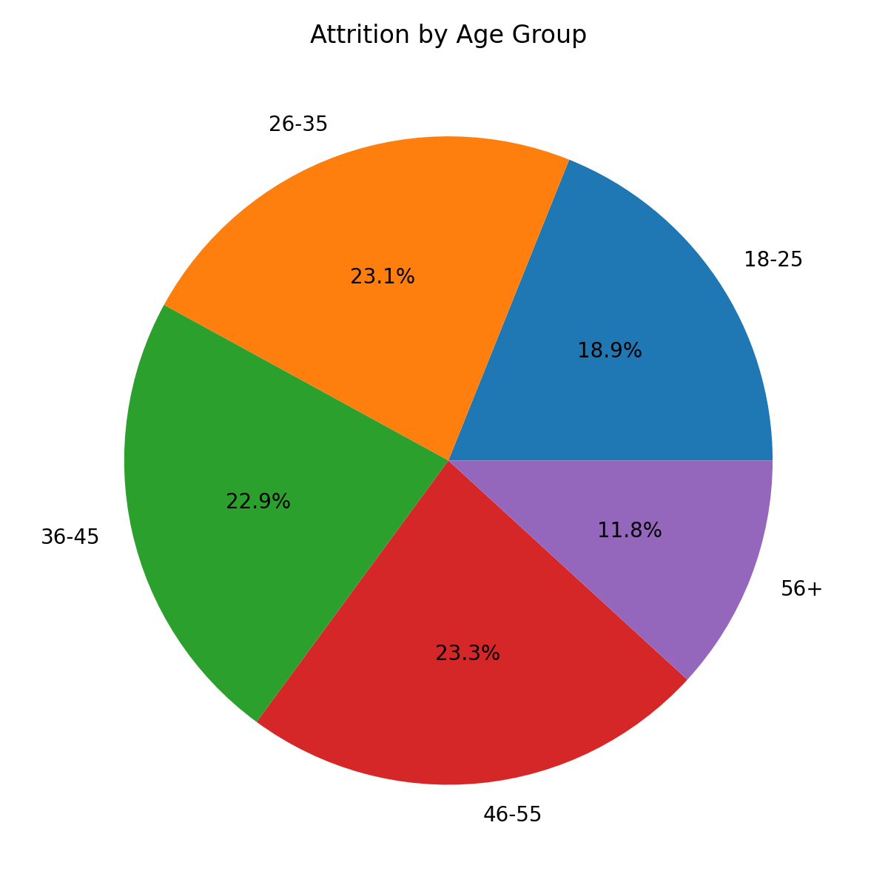

# 👥 HR Analytics | Employee Attrition & Workforce Insights

---

# 📌 Project Background

## Business Overview

Employee attrition is one of the most significant challenges faced by modern organizations. High turnover increases recruitment costs, reduces productivity, impacts employee morale, and slows business growth. Understanding why employees leave and identifying the departments, demographics, and workforce characteristics associated with higher attrition enables HR leaders to implement effective retention strategies.

This project analyzes a workforce dataset containing **50,000 employee records** to uncover trends related to employee attrition, departmental performance, compensation, work-life balance, demographics, and career progression.

Using **SQL**, **Power BI**, **Tableau**, and **Excel**, the project transforms raw HR data into actionable insights that support evidence-based workforce planning and strategic HR decision-making.

---

# 🎯 Business Objectives

This project aims to answer the following business questions:

- Which departments experience the highest employee attrition?
- Which employee age groups are most likely to leave?
- Does monthly income influence employee attrition?
- Which job roles have lower work-life balance?
- How does experience impact employee retention?
- Which employee segments require immediate HR intervention?

---

# 📊 Key Areas of Analysis

- Workforce Overview
- Employee Attrition Analysis
- Department Performance
- Employee Demographics
- Compensation Analysis
- Work-Life Balance
- Career Progression

---

# 🛠 Tech Stack

- **SQL (MySQL)** – Data extraction, cleaning, and business analysis
- **Microsoft Excel** – Data preprocessing and validation
- **Power BI** – Interactive HR dashboard and KPI reporting
- **Tableau** – Workforce visualization and exploratory analytics

---

# 📂 Project Resources

- 📄 [SQL Analysis](sql/hr_analytics_analysis.sql)
- 📊 [Power BI Dashboard](powerbi/HR_Analytics.pbix)
- 📈 [Tableau Dashboard](tableau/HR_Analytics.twbx)
- 📁 [Dataset](data/hr_analytics.csv)

---

# 🗂 Data Structure & Initial Checks

The project consists of a single employee fact table containing workforce information for **50,000 employees** across multiple departments and job roles.

### Key Columns

- Employee ID
- Department
- Job Role
- Gender
- Marital Status
- Education Field
- Monthly Income
- Attrition
- Years at Company
- Years Since Last Promotion
- Work-Life Balance
- Age
- Performance Rating

---

# 📈 Executive Summary

## Overview of Findings

The analysis evaluates **50,000 employees** to understand workforce composition and the primary drivers of employee attrition.

Three major insights emerged from the analysis:

- **25,105 employees left the organization**, resulting in an attrition rate of **50.21%**, indicating substantial workforce turnover.
- Attrition is concentrated within the **Sales**, **Research & Development**, **Human Resources**, and **Support** departments, suggesting department-specific retention challenges.
- Employees aged **26–45 years** account for the largest proportion of attrition, while average monthly income remains relatively similar between employees who stayed and those who left, indicating that compensation alone does not fully explain employee turnover.

These findings provide HR leadership with valuable insights to prioritize employee engagement, improve retention strategies, and allocate workforce development resources effectively.

---
# 📊 Dashboard Deliverables

This project includes dashboards developed using two Business Intelligence platforms to demonstrate proficiency across multiple visualization tools.

### Tableau

- Executive workforce overview
- Employee attrition trends
- Income analysis
- Work-life balance
- Departmental performance

### Power BI

- HR KPI dashboard
- Attrition analysis
- Employee demographics
- Education insights
- Marital status analysis
- Job role analysis

---

# 📷 Dashboard Preview

## Tableau Dashboard

The Tableau dashboard provides an executive overview of workforce composition, employee attrition, work-life balance, income distribution, and demographic trends. Interactive filters enable HR teams to explore employee behavior across departments, age groups, and job roles.

---

## Power BI Dashboard

The Power BI dashboard focuses on employee attrition, workforce demographics, education, marital status, departmental performance, and HR KPIs through interactive visualizations designed for operational decision-making.

---

# 🔍 Insights Deep Dive

---

# 👥 Workforce Overview

### Key Metrics

| KPI | Value |
|------|-------|
| Total Employees | **50,000** |
| Employees Left | **25,105** |
| Active Employees | **24,895** |
| Attrition Rate | **50.21%** |
| Average Age | **39 Years** |
| Average Monthly Income | **₹26,016** |
| Average Working Years | **11 Years** |

### Business Insight

The organization experiences a high employee turnover rate, emphasizing the need for targeted retention initiatives and continuous workforce monitoring.

---

# 📉 Department-wise Attrition Analysis

### Key Findings

- Sales records one of the highest employee attrition counts.
- Research & Development experiences similarly high workforce turnover.
- Human Resources and Support departments also show elevated attrition.
- Attrition is consistently distributed across operational departments rather than isolated to a single business unit.

### Business Insight

Department-specific retention programs should be developed, focusing on workload, employee engagement, and career progression within high-turnover departments.

---

# 🎂 Employee Age Analysis

### Key Findings

- Employees aged **26–35** represent the largest attrition group.
- The **36–45** age group closely follows.
- Employees above **56 years** contribute the lowest attrition levels.

### Business Insight

Mid-career employees appear to be the most mobile workforce segment. HR should strengthen career development, internal mobility, and leadership pathways to improve retention.

---

# 💰 Compensation Analysis

### Key Findings

- Average Monthly Income (Employees Stayed): **₹25.96K**
- Average Monthly Income (Employees Left): **₹26.07K**

### Business Insight

Income differences between retained and departing employees are minimal, suggesting that compensation alone is not the primary factor driving employee attrition.

---

# ⚖ Work-Life Balance Analysis

### Key Findings

- Average work-life balance scores remain close to **2.5** across most job roles.
- Variations between departments are relatively small.

### Business Insight

Rather than role-specific interventions, organization-wide initiatives promoting flexibility and employee wellbeing are likely to deliver greater improvements in retention.

---

# 📚 Education & Workforce Composition

### Key Findings

- Employees come from diverse educational backgrounds.
- Medical, Technical Degree, Human Resources, Marketing, and Life Sciences represent the largest employee groups.

### Business Insight

Future talent acquisition strategies should continue leveraging diverse educational pipelines while investing in cross-functional learning opportunities.

---

# 💡 Recommendations

Based on the analysis, the following recommendations are proposed:

### 1. Prioritize High-Attrition Departments

Focus retention initiatives within Sales, Research & Development, Human Resources, and Support departments.

---

### 2. Strengthen Career Development

Provide structured career progression plans for employees with **5–10 years** of experience to reduce mid-career attrition.

---

### 3. Improve Employee Engagement

Conduct regular engagement surveys and manager feedback sessions to identify early indicators of employee dissatisfaction.

---

### 4. Enhance Work-Life Balance Programs

Introduce flexible work arrangements, wellness initiatives, and workload optimization to improve employee experience.

---

### 5. Develop Predictive HR Analytics

Implement predictive attrition models using historical employee data to proactively identify employees at high risk of leaving.

---

# ⚠ Assumptions & Limitations

- Missing values were cleaned during preprocessing.
- Workforce metrics represent the available historical dataset only.
- Attrition drivers are analyzed using available variables and may not include external organizational factors.
- Monthly income values are analyzed without adjustments for inflation or location.

---

# 🚀 Skills Demonstrated

- SQL Querying
- Data Cleaning
- Exploratory Data Analysis (EDA)
- Data Modeling
- KPI Development
- Power BI Dashboard Development
- Tableau Dashboard Development
- Excel Data Analysis
- HR Analytics
- Workforce Analytics
- Business Intelligence
- Data Visualization
- Business Recommendations

---

# 👨‍💻 Author

**Shubham Kumar Bharti**

**Data Analyst**

📧 Email

💼 LinkedIn

💻 GitHub
